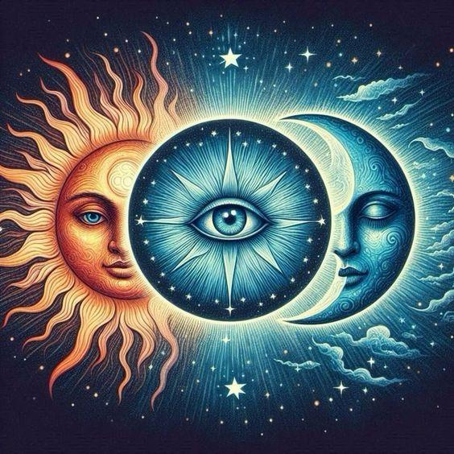
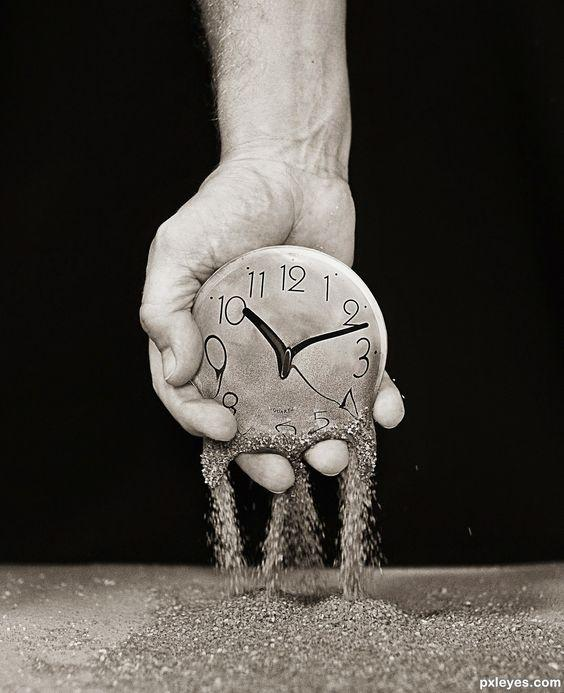
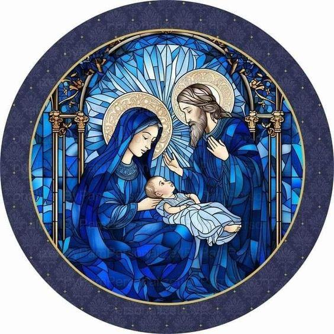

+++
title = 'Qui E Ora - Il Servizio Del Sole E Della Luna'
date = 2024-09-30T15:18:41+02:00
draft = false
author = 'Mirko Lancerotto'
description = 'Matriarcato e patriarcato possono coesistere effettivamente, in realtà già lo fanno. Sono gli occhiali di questo tempo a farcele vedere divise o sbagliate.'
+++

Servo e servizio sono due cose diverse, esatto. Servizio è l'atto che fa il servo. Quando c'è servizio, dietro c'è un servo. Senza accezione negativa o positiva, è un fatto di linguaggio.  \
È bello essere servi di Dio.

Si può vedere anche il Sole come il servo della vita che ridona vita incondizionatamente alla Luna e a tutti gli altri pianeti, satelliti o qualsivoglia superficie volta ad accoglierlo. \
È il principio riflettente, quindi lunare, del Sole.

Si può vedere la Luna come serva della vita che ridona la vita emanata dal Sole, quindi indirettamente serva del Sole. \
È il principio solare della Luna, la quale riflettendo il Sole si fa a sua immagine e somiglianza.

*Matriarcato e patriarcato* possono coesistere effettivamente, in realtà già lo fanno.  \
Sono gli occhiali di questo tempo a farcele vedere divise o sbagliate.

 \
 \
**Tutto ciò che costruiamo sul tempo sono solo come castelli di sabbia.**

Il tempo certo che esiste, lo percepiamo, però è assurdo, quindi falso dalla prospettiva dell’Eterno Presente. \
E si può vedere in qual modo esso sia falso. \
 \
Talvolta il tempo risulta apparentemente vero dalla prospettiva delle apparenze, ovvero del mondo fenomenico, detto anche fisico, materiale, necessariamente radicato nel movimento, quindi nel tempo stesso. \
Qualsivoglia movimento richiede infatti tempo. \
 \
Il tempo è duale, implica necessariamente una qualsiasi forma di passato e futuro.

Sono le menzogne che creano conflitti, distanze, repulsioni.

Viviamo un tempo che rende la percezione dell’eternità del Qui ed Ora distante da noi, pare impossibile essere veramente presenti. \
Un tempo che ci fa sentire sbagliati, abbandonati, che rende il nostro ritrovarci lontano nel futuro, che rende il passato la causa del nostro presente.

Ebbene non è così cari amici, questo è un tempo che ci mente.

Guarda caso invece il Qui ed Ora è un tempo ed un luogo che non cambiano mai.  \
La fonte stessa dello spazio e del tempo. \
Il Qui è l’origine ed il terreno di tutti i miei spostamenti. \
È nell’Ora che passato e futuro hanno origine e che li ricordo. \
Il Qui ed Ora accoglie tutti gli eventi indiscriminatamente, è l'unico vero luogo di unione, di riconciliazione. \
 \
Tutti gli eventi passati e futuri, tutti i luoghi del mondo e dell’universo trovano origine e manifestazione nel Qui ed Ora.

Cari amici, si, l'Eterno ammette anche la menzogna, non si difende dal peccatore ma lo accoglie a braccia spiegate, anzi è la menzogna a temere l'Eterno.

L’eterno Qui ed Ora è pura umiltà, immenso, degno di essere amato sopra ogni cosa. \
È il cuore del tempo e dello spazio.

Non tutti i tempi furono menzogneri, Ora è il tempo di ritornare al Qui ed Ora, l'eterno presente, dove padre e madre cooperano in un'armonia suprema.

Nell'Eterno Presente esistono numerose dimensioni temporali ed atemporali.

L'astrologia classica e moderna sono poca cosa di fronte l'immensità dell'Eterno, infatti anch'esse sono inscritte nel tempo.

Eppure la piccola riflessione astrologica può essere un ottimo servizio all'Eterno. \
Anche un umile satellite riflette la volontà dell’Eterno.

La trinità, dove al vertice troviamo questo Eterno, l'inafferrabile onnipresente Qui ed Ora, può vedere presenti ai due pedici le polarità del binomio Sole e Luna.

Queste polarità riflettono le due qualità occulte ed opposte del Qui ed Ora, che quindi divengono oggettive, sperimentabili, materiche.

Il binomio vergine/pesci ci fa riflettere appunto in questi termini mostrando come il servizio stesso di un binomio sia verso un dio eterno, inafferrabile, imperscrutabile, occulto. La sublime ed onnipresente armonia dell'universo, primo motore immobile del mondo ordinario.
